<Note>
  **Business Use Case**: High-concurrency, production-grade answer generation
  for LLMs, enterprise search, and knowledge assistants **Example
  Implementations**: Perplexity Pro, enterprise RAG (Retrieval-Augmented
  Generation) systems, customer support answer engines, ChatGPT-style search
  applications
</Note>

## Overview

Answer engines are specialized AI systems that retrieve real-time web data to augment LLM responses with current, factual information. This architecture powers the next generation of search and question-answering systems used by millions of users daily.

**Key Challenges Solved:**

- Ultra-high concurrency (10K-50K simultaneous queries)
- Sub-second response times at global scale
- Real-time web data integration with LLMs
- Source reliability and answer validation
- Cost efficiency at massive scale

**Value Proposition:**

- **Better answers**: Current web data beats stale training data
- **Verifiable**: Citations and sources for every claim
- **Scalable**: Handle millions of queries per day
- **Cost-effective**: 70-90% cheaper than manual curation

## Architecture Diagram

```mermaid
graph TB
    A[Input Layer<br/>User Query<br/>API/Chat/System] --> B[Orchestration Layer]
    B[Answer Orchestrator<br/>Session Manager] --> C[Discovery Layer]
    C[SERP API 20K/s<br/>Relevance Ranker] --> D[Extraction Layer]
    D[Web Unlocker 50K/s<br/>Data Feeds] --> E[Synthesis Layer]
    E[LLM Synthesizer<br/>Answer Validator] --> F[Output Layer<br/>Answer + Citations]

    style A fill:#1a1a2e
    style B fill:#16213e
    style C fill:#0f3460
    style D fill:#533483
    style E fill:#16213e
    style F fill:#1a1a2e
```



## Layer-by-Layer Breakdown

### 1. Input Layer: Query Reception

**Purpose**: Receive and normalize user queries from multiple channels

**Input Sources:**

- **Chat Interface**: Conversational Q&A (like ChatGPT)
- **API Requests**: Programmatic answer generation
- **System Triggers**: Automated knowledge updates
- **Voice Queries**: Alexa/Siri-style voice assistants

**Query Types:**

<Tabs>
  <Tab title="Factual Queries">
    **"What is the current price of Bitcoin?"**
    
    **Characteristics:**
    - Single fact lookup
    - Requires real-time data
    - Needs authoritative source
    - Response time: less than 2 seconds
    
    **Sources**: CoinMarketCap, Coinbase, financial APIs
  </Tab>
  
  <Tab title="Analytical Queries">
    **"Compare Tesla vs Rivian EV range and pricing"**
    
    **Characteristics:**
    - Multi-source comparison
    - Structured data extraction
    - Requires validation
    - Response time: 3-5 seconds
    
    **Sources**: Official websites, review sites, specifications databases
  </Tab>
  
  <Tab title="Complex Queries">
    **"Explain the latest developments in quantum computing and their business applications"**
    
    **Characteristics:**
    - Multi-source synthesis
    - Requires context and analysis
    - Deep LLM integration
    - Response time: 5-10 seconds
    
    **Sources**: Academic papers, news, company announcements, tech blogs
  </Tab>
</Tabs>

**Query Preprocessing:**

```python
# query-processor.py
from typing import Dict, List
import re
from datetime import datetime

class QueryProcessor:
    def __init__(self):
        self.factual_keywords = ['price', 'cost', 'date', 'when', 'where', 'who']
        self.analytical_keywords = ['compare', 'vs', 'difference', 'better', 'analysis']
        self.complex_keywords = ['explain', 'why', 'how', 'comprehensive', 'detailed']

    def process(self, query: str) -> Dict:
        """Process and classify incoming query"""
        query_lower = query.lower()

        # Detect query type
        query_type = self.detect_type(query_lower)

        # Extract entities (companies, products, people, dates)
        entities = self.extract_entities(query)

        # Detect temporal requirements
        temporal = self.detect_temporal(query_lower)

        # Estimate required sources
        num_sources = self.estimate_sources(query_type)

        return {
            'original_query': query,
            'type': query_type,
            'entities': entities,
            'temporal': temporal,
            'num_sources_needed': num_sources,
            'priority': self.calculate_priority(query),
            'processed_at': datetime.utcnow().isoformat()
        }

    def detect_type(self, query: str) -> str:
        """Classify query complexity"""
        if any(kw in query for kw in self.factual_keywords):
            return 'factual'
        elif any(kw in query for kw in self.analytical_keywords):
            return 'analytical'
        elif any(kw in query for kw in self.complex_keywords):
            return 'complex'
        else:
            return 'general'

    def extract_entities(self, query: str) -> List[str]:
        """Extract named entities from query"""
        # Simplified - would use spaCy or similar in production
        # Look for capitalized words (potential company/product names)
        entities = re.findall(r'\b[A-Z][a-z]+(?:\s+[A-Z][a-z]+)*\b', query)
        return entities

    def detect_temporal(self, query: str) -> str:
        """Detect if query requires current or historical data"""
        current_keywords = ['current', 'latest', 'now', 'today', 'recent']
        historical_keywords = ['was', 'historical', 'past', 'previously']

        if any(kw in query for kw in current_keywords):
            return 'current'
        elif any(kw in query for kw in historical_keywords):
            return 'historical'
        else:
            return 'current'  # Default to current data

    def estimate_sources(self, query_type: str) -> int:
        """Estimate number of sources needed"""
        source_map = {
            'factual': 3,      # Quick fact-check
            'analytical': 5,   # Compare sources
            'complex': 10,     # Comprehensive analysis
            'general': 5
        }
        return source_map.get(query_type, 5)

    def calculate_priority(self, query: str) -> str:
        """Assign query priority for queue management"""
        # Could be based on user tier, query urgency, etc.
        urgent_keywords = ['urgent', 'asap', 'immediately']
        if any(kw in query.lower() for kw in urgent_keywords):
            return 'high'
        return 'normal'

# Usage
processor = QueryProcessor()
processed_query = processor.process("What is Tesla's current stock price?")

print(processed_query)
# {
#   'type': 'factual',
#   'entities': ['Tesla'],
#   'temporal': 'current',
#   'num_sources_needed': 3,
#   'priority': 'normal'
# }
```

### 2. Orchestration Layer: High-Concurrency Management

**Purpose**: Handle 10K-50K concurrent answer requests with sub-second latency

**Key Components:**

<CardGroup cols={2}>
  <Card title="Answer Orchestrator" icon="circle-nodes">
    **Manages End-to-End Answer Flow** - Request queuing and prioritization -
    Parallel source discovery and extraction - Timeout management (abort slow
    sources) - Rate limiting and backpressure - Result streaming to users
    **Performance**: Handles 50K+ concurrent requests
  </Card>

  <Card title="Session Manager" icon="database">
    **Maintains Conversation Context** - Multi-turn conversations (follow-up
    questions) - Context window management - User preferences and history - A/B
    testing and experimentation - Analytics and metrics tracking **Storage**:
    Redis for hot sessions, PostgreSQL for history
  </Card>
</CardGroup>

**Production Implementation:**

```typescript
// answer-orchestrator.ts
import { WebUnlocker, SerpAPI, DataFeeds } from "brightdata-sdk";
import Redis from "ioredis";
import { Queue, Worker } from "bullmq";
import OpenAI from "openai";

interface AnswerRequest {
  queryId: string;
  userId: string;
  query: string;
  sessionId?: string;
  priority: "low" | "normal" | "high";
}

interface AnswerResponse {
  queryId: string;
  answer: string;
  sources: Array<{ url: string; title: string; snippet: string }>;
  confidence: number;
  processingTime: number;
}

class AnswerOrchestrator {
  private redis: Redis;
  private queue: Queue;
  private serp: SerpAPI;
  private unlocker: WebUnlocker;
  private openai: OpenAI;
  private activeConcurrency: number = 0;
  private maxConcurrency: number = 50000;

  constructor(config: any) {
    this.redis = new Redis(config.redisUrl);
    this.queue = new Queue("answers", { connection: this.redis });
    this.serp = new SerpAPI({ apiKey: config.brightdataKey, format: "parsed" });
    this.unlocker = new WebUnlocker({
      apiKey: config.brightdataKey,
      asyncMode: true,
    });
    this.openai = new OpenAI({ apiKey: config.openaiKey });

    // Start worker to process queue
    this.startWorker();
  }

  async generateAnswer(request: AnswerRequest): Promise<AnswerResponse> {
    const startTime = Date.now();

    // Check if we're at capacity
    if (this.activeConcurrency >= this.maxConcurrency) {
      // Queue for later processing
      await this.queue.add("answer", request, {
        priority:
          request.priority === "high" ? 1 : request.priority === "low" ? 3 : 2,
      });
      throw new Error("System at capacity, request queued");
    }

    this.activeConcurrency++;

    try {
      // Step 1: Check cache (avoid redundant queries)
      const cached = await this.checkCache(request.query);
      if (cached && !this.requiresFreshData(request.query)) {
        return { ...cached, processingTime: Date.now() - startTime };
      }

      // Step 2: Discover sources (parallel with context retrieval)
      const [sources, context] = await Promise.all([
        this.discoverSources(request.query),
        this.getConversationContext(request.sessionId),
      ]);

      // Step 3: Extract from top sources (high concurrency)
      const extractions = await this.extractSources(sources.slice(0, 5));

      // Step 4: Generate answer with LLM
      const answer = await this.synthesizeAnswer(
        request.query,
        extractions,
        context
      );

      // Step 5: Validate and score confidence
      const validated = await this.validateAnswer(answer, extractions);

      // Step 6: Cache result
      await this.cacheAnswer(request.query, validated);

      const response = {
        queryId: request.queryId,
        ...validated,
        processingTime: Date.now() - startTime,
      };

      return response;
    } finally {
      this.activeConcurrency--;
    }
  }

  private async checkCache(query: string): Promise<AnswerResponse | null> {
    const cacheKey = `answer:${this.hashQuery(query)}`;
    const cached = await this.redis.get(cacheKey);

    if (cached) {
      return JSON.parse(cached);
    }
    return null;
  }

  private requiresFreshData(query: string): boolean {
    // Detect if query needs real-time data
    const realtimeKeywords = [
      "current",
      "latest",
      "now",
      "today",
      "price",
      "stock",
    ];
    return realtimeKeywords.some((kw) => query.toLowerCase().includes(kw));
  }

  private async discoverSources(query: string): Promise<any[]> {
    // Use SERP API to find relevant sources
    const results = await this.serp.search(query, { numResults: 10 });
    return results.results || [];
  }

  private async getConversationContext(sessionId?: string): Promise<string> {
    if (!sessionId) return "";

    const contextKey = `session:${sessionId}:context`;
    const context = await this.redis.get(contextKey);
    return context || "";
  }

  private async extractSources(sources: any[]): Promise<any[]> {
    // Extract from multiple sources in parallel
    const extractions = await Promise.all(
      sources.map(async (source) => {
        try {
          const response = await this.unlocker.get(source.url, {
            format: "markdown",
            timeout: 10000, // Aggressive timeout
          });

          return {
            url: source.url,
            title: source.title,
            content: response.text.slice(0, 5000), // Limit for LLM
            snippet: source.snippet,
          };
        } catch (err) {
          console.error(`Extraction failed for ${source.url}`);
          return null;
        }
      })
    );

    return extractions.filter((e) => e !== null);
  }

  private async synthesizeAnswer(
    query: string,
    extractions: any[],
    context: string
  ): Promise<{ answer: string; sources: any[] }> {
    // Prepare source material for LLM
    const sourceText = extractions
      .map((e, i) => `[${i + 1}] ${e.title}\n${e.content}\nSource: ${e.url}`)
      .join("\n\n---\n\n");

    // Generate answer with citations
    const response = await this.openai.chat.completions.create({
      model: "gpt-4-turbo",
      messages: [
        {
          role: "system",
          content: `You are a helpful assistant that answers questions using provided web sources. 
Always cite sources using [1], [2], etc. 
Be concise but comprehensive. 
If sources conflict, mention the discrepancy.
If sources don't contain the answer, say so clearly.`,
        },
        ...(context ? [{ role: "assistant", content: context }] : []),
        {
          role: "user",
          content: `Question: ${query}\n\nSources:\n${sourceText}\n\nProvide a clear answer with citations.`,
        },
      ],
      temperature: 0.3,
      max_tokens: 500,
    });

    return {
      answer: response.choices[0].message.content || "",
      sources: extractions.map((e, i) => ({
        index: i + 1,
        url: e.url,
        title: e.title,
        snippet: e.snippet,
      })),
    };
  }

  private async validateAnswer(
    answer: { answer: string; sources: any[] },
    extractions: any[]
  ): Promise<AnswerResponse> {
    // Calculate confidence score
    const confidence = this.calculateConfidence(answer, extractions);

    return {
      queryId: "", // Will be set by caller
      answer: answer.answer,
      sources: answer.sources,
      confidence,
      processingTime: 0, // Will be set by caller
    };
  }

  private calculateConfidence(answer: any, extractions: any[]): number {
    let confidence = 0.5; // Base confidence

    // More sources = higher confidence
    if (extractions.length >= 5) confidence += 0.2;
    else if (extractions.length >= 3) confidence += 0.1;

    // Check if answer includes citations
    const citationCount = (answer.answer.match(/\[\d+\]/g) || []).length;
    if (citationCount >= 3) confidence += 0.2;
    else if (citationCount >= 1) confidence += 0.1;

    // Check source quality (simplified)
    const hasAuthoritativeSource = extractions.some(
      (e) => e.url.includes(".edu") || e.url.includes(".gov")
    );
    if (hasAuthoritativeSource) confidence += 0.1;

    return Math.min(confidence, 1.0);
  }

  private async cacheAnswer(
    query: string,
    answer: AnswerResponse
  ): Promise<void> {
    const cacheKey = `answer:${this.hashQuery(query)}`;
    const ttl = this.requiresFreshData(query) ? 300 : 3600; // 5min or 1hr

    await this.redis.setex(cacheKey, ttl, JSON.stringify(answer));
  }

  private hashQuery(query: string): string {
    // Simple hash for cache key (use crypto.createHash in production)
    return Buffer.from(query.toLowerCase().trim()).toString("base64");
  }

  private startWorker(): void {
    // Process queued requests
    const worker = new Worker(
      "answers",
      async (job) => {
        return await this.generateAnswer(job.data);
      },
      { connection: this.redis, concurrency: 100 }
    );

    worker.on("completed", (job) => {
      console.log(`Completed answer ${job.id}`);
    });

    worker.on("failed", (job, err) => {
      console.error(`Failed answer ${job?.id}:`, err);
    });
  }
}

// Usage
const orchestrator = new AnswerOrchestrator({
  redisUrl: process.env.REDIS_URL,
  brightdataKey: process.env.BRIGHTDATA_KEY,
  openaiKey: process.env.OPENAI_KEY,
});

// Handle incoming queries
app.post("/api/answer", async (req, res) => {
  const request: AnswerRequest = {
    queryId: generateId(),
    userId: req.user.id,
    query: req.body.query,
    sessionId: req.body.sessionId,
    priority: req.user.tier === "premium" ? "high" : "normal",
  };

  try {
    const answer = await orchestrator.generateAnswer(request);
    res.json(answer);
  } catch (err) {
    if (err.message.includes("queued")) {
      res.status(429).json({ error: "System busy, please retry" });
    } else {
      res.status(500).json({ error: "Answer generation failed" });
    }
  }
});
```

<Info>
  **Performance Note**: This architecture handles 50K+ concurrent queries by
  combining aggressive timeouts, intelligent caching, and Bright Data's scalable
  infrastructure. The queue system prevents overload while maintaining
  sub-second p95 latency.
</Info>

### 3. Discovery Layer: Source Finding

**Purpose**: Rapidly identify the most relevant and authoritative sources for each query

**Components:**

<CardGroup cols={2}>
  <Card title="SERP API" icon="magnifying-glass">
    **Bright Data SERP API** - 20K searches/second capacity - Sub-500ms global
    latency - Parsed JSON (no scraping needed) - Date filters and result ranking
    **Answer Engine Optimization:** - Use `num_results=10` for speed - Enable
    `freshness` filters for time-sensitive queries - Parse structured data
    (price, ratings, etc.)
  </Card>

  <Card title="Relevance Ranker" icon="ranking-star">
    **ML-Powered Source Ranking** - Query-source semantic similarity - Source
    authority scoring - Freshness weighting - Diversity optimization **Result**:
    Top 3-5 sources that maximize answer quality
  </Card>
</CardGroup>

**Implementation:**

```python
# source-discovery.py
from brightdata import SerpAPI
from typing import List, Dict
import numpy as np
from sklearn.metrics.pairwise import cosine_similarity
from sentence_transformers import SentenceTransformer

class SourceDiscovery:
    def __init__(self, api_key: str):
        self.serp = SerpAPI(api_key=api_key, format='parsed')
        self.embedding_model = SentenceTransformer('all-MiniLM-L6-v2')

    async def discover_and_rank(self, query: str, num_sources: int = 5) -> List[Dict]:
        """Discover and rank sources for answer generation"""

        # Step 1: SERP search
        results = await self.serp.search(query, num_results=15)

        if not results.get('results'):
            return []

        # Step 2: Compute relevance scores
        query_embedding = self.embedding_model.encode([query])[0]

        scored_sources = []
        for result in results['results']:
            # Compute semantic similarity
            text = f"{result.get('title', '')} {result.get('snippet', '')}"
            source_embedding = self.embedding_model.encode([text])[0]
            relevance = cosine_similarity([query_embedding], [source_embedding])[0][0]

            # Authority score
            authority = self.score_authority(result.get('url', ''))

            # Freshness score
            freshness = self.score_freshness(result.get('date'))

            # Combined score (weighted)
            total_score = (
                relevance * 0.5 +
                authority * 0.3 +
                freshness * 0.2
            )

            scored_sources.append({
                **result,
                'relevance': float(relevance),
                'authority': authority,
                'freshness': freshness,
                'total_score': total_score
            })

        # Step 3: Sort and diversify
        scored_sources.sort(key=lambda x: x['total_score'], reverse=True)
        diversified = self.diversify_sources(scored_sources)

        return diversified[:num_sources]

    def score_authority(self, url: str) -> float:
        """Score source authority"""
        authority_map = {
            '.edu': 0.95,
            '.gov': 0.95,
            '.org': 0.70,
            'wikipedia.org': 0.85,
            'reuters.com': 0.90,
            'bloomberg.com': 0.90,
            'techcrunch.com': 0.80,
            'theverge.com': 0.75
        }

        for domain, score in authority_map.items():
            if domain in url:
                return score

        return 0.50  # Default for unknown domains

    def score_freshness(self, date_str: str) -> float:
        """Score content freshness"""
        if not date_str:
            return 0.5

        from datetime import datetime
        try:
            date = datetime.fromisoformat(date_str.replace('Z', '+00:00'))
            age_days = (datetime.now(date.tzinfo) - date).days

            # Exponential decay over 90 days
            return max(0.1, np.exp(-age_days / 90))
        except:
            return 0.5

    def diversify_sources(self, sources: List[Dict]) -> List[Dict]:
        """Ensure source diversity (different domains)"""
        seen_domains = set()
        diversified = []

        for source in sources:
            domain = source['url'].split('/')[2]
            if domain not in seen_domains:
                diversified.append(source)
                seen_domains.add(domain)

            if len(diversified) >= 10:
                break

        # Fill remaining slots if needed
        for source in sources:
            if len(diversified) >= len(sources):
                break
            if source not in diversified:
                diversified.append(source)

        return diversified

# Usage
discovery = SourceDiscovery(api_key='your_key')
sources = await discovery.discover_and_rank("What is the current Bitcoin price?")

for source in sources:
    print(f"{source['title']} (score: {source['total_score']:.2f})")
    print(f"  URL: {source['url']}")
    print(f"  Relevance: {source['relevance']:.2f}, Authority: {source['authority']:.2f}")
```

### 4. Extraction Layer: Content Retrieval

**Purpose**: Extract content from discovered sources at massive scale

<Tabs>
  <Tab title="Web Unlocker API">
    **Primary Extraction Method** (95% of use cases)
    
    **Configuration for Answer Engines:**
    ```python
    from brightdata import WebUnlocker
    
    unlocker = WebUnlocker(
        api_key='your_key',
        async_mode=True,      # Critical for concurrency
        format='markdown',     # Clean text for LLMs
        timeout=10000,         # Aggressive timeout (10s)
        country='us',          # Geo-targeting if needed
        device='desktop'       # Consistent rendering
    )
    
    # Extract with timeout
    try:
        response = await unlocker.get(url)
        content = response.text[:8000]  # Limit for LLM context
    except TimeoutError:
        # Skip slow sources
        content = None
    ```
    
    **Performance:**
    - 50K/s throughput
    - 95-99% success rate
    - 2-4s average response time
    - $0.01-0.03 per successful request
  </Tab>
  
  <Tab title="Data Feeds">
    **Structured Data Sources**
    
    For common queries (stocks, weather, etc.), use pre-structured feeds:
    
    ```typescript
    import { DataFeeds } from 'brightdata-sdk';
    
    const feeds = new DataFeeds({ apiKey: 'your_key' });
    
    // Instant stock data
    if (query.includes('stock price')) {
      const ticker = extractTicker(query);  // e.g., "TSLA"
      const stockData = await feeds.getStockPrice(ticker);
      
      // Return immediately, no extraction needed
      return {
        answer: `${ticker} is currently trading at $${stockData.price}`,
        sources: [{ url: stockData.source, title: `${ticker} Stock Quote` }],
        confidence: 0.99
      };
    }
    ```
    
    **Benefits:**
    - Sub-second response
    - 99.9% accuracy
    - No parsing needed
    - Lower cost
  </Tab>
</Tabs>

**Parallel Extraction Strategy:**

```typescript
// Extract from multiple sources with intelligent concurrency
async function extractParallel(
  sources: Source[],
  maxParallel = 10
): Promise<Extraction[]> {
  const chunks = chunkArray(sources, maxParallel);
  const results: Extraction[] = [];

  for (const chunk of chunks) {
    // Extract chunk in parallel
    const extractions = await Promise.allSettled(
      chunk.map((source) => extractWithTimeout(source, 10000))
    );

    // Collect successful extractions
    for (const result of extractions) {
      if (result.status === "fulfilled" && result.value) {
        results.push(result.value);

        // Early exit if we have enough high-quality sources
        if (results.length >= 5) {
          return results;
        }
      }
    }
  }

  return results;
}

async function extractWithTimeout(
  source: Source,
  timeout: number
): Promise<Extraction | null> {
  const controller = new AbortController();
  const timeoutId = setTimeout(() => controller.abort(), timeout);

  try {
    const response = await unlocker.get(source.url, {
      signal: controller.signal,
    });

    clearTimeout(timeoutId);

    return {
      url: source.url,
      title: source.title,
      content: response.text.slice(0, 8000),
      extractedAt: new Date(),
    };
  } catch (err) {
    // Log but don't throw - we have other sources
    console.warn(`Extraction failed for ${source.url}: ${err.message}`);
    return null;
  } finally {
    clearTimeout(timeoutId);
  }
}
```

<Tip>
  **Performance Optimization**: Aggressive timeouts (5-10s) and early exits
  (return after 5 sources) are critical for sub-second answer generation. Don't
  wait for slow sources—99% of the time, 3-5 fast sources are sufficient.
</Tip>

### 5. Synthesis Layer: Answer Generation

**Purpose**: Generate accurate, cited answers from extracted content

<CardGroup cols={2}>
  <Card title="LLM Synthesizer" icon="brain">
    **GPT-4/Claude/Llama Integration** - Combine multiple sources into coherent
    answer - Generate citations for every claim - Handle conflicting information
    - Maintain conversation context **Key Parameters:** - Temperature: 0.3
    (factual, not creative) - Max tokens: 300-500 (concise answers) - System
    prompt: Emphasize citations and accuracy
  </Card>

  <Card title="Answer Validator" icon="shield-check">
    **Quality Assurance** - Verify claims against sources - Detect
    hallucinations - Calculate confidence score - Flag uncertain answers
    **Confidence Factors:** - Source count and quality - Citation density -
    Cross-source agreement - Recency of data
  </Card>
</CardGroup>

**Production Implementation:**

```python
# answer-synthesizer.py
import openai
from typing import List, Dict
import re

class AnswerSynthesizer:
    def __init__(self, openai_key: str):
        self.client = openai.Client(api_key=openai_key)

        self.system_prompt = """You are a helpful AI assistant that answers questions using web sources.

CRITICAL RULES:
1. ALWAYS cite sources using [1], [2], etc.
2. ONLY use information from provided sources
3. If sources conflict, mention the discrepancy
4. If sources don't answer the question, say so clearly
5. Be concise but comprehensive (2-4 paragraphs max)
6. For numerical data, specify the date/timestamp if available
7. NEVER make up information not in sources"""

    async def synthesize(
        self,
        query: str,
        extractions: List[Dict],
        context: str = ""
    ) -> Dict:
        """Generate answer from sources"""

        # Prepare source material
        source_text = self.format_sources(extractions)

        # Generate answer
        messages = [
            {"role": "system", "content": self.system_prompt}
        ]

        if context:
            messages.append({"role": "assistant", "content": f"Previous context: {context}"})

        messages.append({
            "role": "user",
            "content": f"""Question: {query}

Sources:
{source_text}

Provide a clear, accurate answer with citations [1], [2], etc."""
        })

        response = await self.client.chat.completions.create(
            model="gpt-4-turbo",
            messages=messages,
            temperature=0.3,
            max_tokens=500
        )

        answer = response.choices[0].message.content

        # Validate and score
        validation = self.validate_answer(answer, extractions)

        return {
            'answer': answer,
            'sources': [
                {
                    'index': i + 1,
                    'url': e['url'],
                    'title': e['title']
                }
                for i, e in enumerate(extractions)
            ],
            'confidence': validation['confidence'],
            'validation': validation
        }

    def format_sources(self, extractions: List[Dict]) -> str:
        """Format extractions for LLM"""
        formatted = []

        for i, extraction in enumerate(extractions):
            formatted.append(f"""[{i + 1}] {extraction['title']}
URL: {extraction['url']}
Content: {extraction['content'][:3000]}  # Limit per source
---""")

        return "\n\n".join(formatted)

    def validate_answer(self, answer: str, extractions: List[Dict]) -> Dict:
        """Validate answer quality and calculate confidence"""

        validation = {
            'has_citations': False,
            'citation_count': 0,
            'hallucination_risk': 'low',
            'confidence': 0.5
        }

        # Check for citations
        citations = re.findall(r'\[(\d+)\]', answer)
        validation['citation_count'] = len(citations)
        validation['has_citations'] = len(citations) > 0

        # Base confidence on source count and citations
        source_factor = min(len(extractions) / 5.0, 1.0)  # Max at 5 sources
        citation_factor = min(len(citations) / 3.0, 1.0)  # Max at 3 citations

        confidence = 0.3 + (source_factor * 0.4) + (citation_factor * 0.3)

        # Penalty for no citations (likely hallucination)
        if len(citations) == 0:
            validation['hallucination_risk'] = 'high'
            confidence *= 0.5

        # Bonus for authoritative sources
        authoritative_count = sum(
            1 for e in extractions
            if '.edu' in e['url'] or '.gov' in e['url']
        )
        if authoritative_count > 0:
            confidence += 0.1

        validation['confidence'] = min(confidence, 1.0)

        return validation

# Usage
synthesizer = AnswerSynthesizer(openai_key='your_key')

answer_result = await synthesizer.synthesize(
    query="What is the current Bitcoin price?",
    extractions=extracted_sources
)

print(f"Answer: {answer_result['answer']}")
print(f"Confidence: {answer_result['confidence']:.0%}")
print(f"Sources: {len(answer_result['sources'])}")
```

### 6. Output Layer: Answer Delivery

**Purpose**: Deliver answers with citations, confidence scores, and metadata

**Output Format:**

<CodeGroup>
```json API Response
{
  "queryId": "qry_abc123",
  "query": "What is the current Bitcoin price?",
  "answer": "As of November 5, 2024, Bitcoin is trading at approximately $35,420 [1][2]. The price has increased 3.2% in the last 24 hours [1]. Major exchanges like Coinbase and Binance report similar prices within a $50 range [2].",
  "sources": [
    {
      "index": 1,
      "title": "Bitcoin Price Live",
      "url": "https://coinmarketcap.com/currencies/bitcoin/",
      "snippet": "BTC $35,420 +3.2% (24h)"
    },
    {
      "index": 2,
      "title": "Bitcoin (BTC) Real-Time Price",
      "url": "https://www.coinbase.com/price/bitcoin",
      "snippet": "Bitcoin price today is $35,385"
    }
  ],
  "confidence": 0.95,
  "processingTime": 1847,
  "timestamp": "2024-11-05T10:30:45Z",
  "metadata": {
    "sourcesDiscovered": 8,
    "sourcesExtracted": 5,
    "sourcesUsed": 2,
    "cacheHit": false
  }
}
```

```typescript Stream Response
// Streaming for better UX
async function* streamAnswer(query: string) {
  // Stream answer as it's generated
  yield { type: 'status', message: 'Discovering sources...' };

  const sources = await discoverSources(query);
  yield { type: 'sources', data: sources };

  yield { type: 'status', message: 'Extracting content...' };

  const extractions = await extractSources(sources);
  yield { type: 'status', message: 'Generating answer...' };

  // Stream LLM response
  const stream = await openai.chat.completions.create({
    model: 'gpt-4-turbo',
    messages: [...],
    stream: true
  });

  for await (const chunk of stream) {
    const content = chunk.choices[0]?.delta?.content;
    if (content) {
      yield { type: 'answer_chunk', data: content };
    }
  }

  yield { type: 'complete', confidence: 0.92 };
}

// Client sees progressive updates
for await (const update of streamAnswer(query)) {
  console.log(update);
  // Update UI in real-time
}
```

</CodeGroup>

## Best Practices for Production

### 1. Caching Strategy

**Multi-Layer Caching:**

```typescript
// Intelligent caching based on query type
class AnswerCache {
  async get(query: string): Promise<Answer | null> {
    const normalized = normalizeQuery(query);

    // L1: In-memory cache (hot queries)
    let cached = memoryCache.get(normalized);
    if (cached) return cached;

    // L2: Redis cache (recent queries)
    cached = await redis.get(`answer:${hash(normalized)}`);
    if (cached) {
      memoryCache.set(normalized, cached);
      return JSON.parse(cached);
    }

    return null;
  }

  async set(query: string, answer: Answer): Promise<void> {
    const normalized = normalizeQuery(query);
    const ttl = this.determineTTL(query);

    // Write to both layers
    memoryCache.set(normalized, answer);
    await redis.setex(
      `answer:${hash(normalized)}`,
      ttl,
      JSON.stringify(answer)
    );
  }

  determineTTL(query: string): number {
    // Real-time data: 5 minutes
    if (/price|stock|weather|current/i.test(query)) {
      return 300;
    }

    // Time-sensitive: 1 hour
    if (/news|latest|recent/i.test(query)) {
      return 3600;
    }

    // Evergreen: 24 hours
    return 86400;
  }
}
```

**Cache Hit Rate Impact:**

- 40% cache hit rate → 60% cost reduction
- 70% cache hit rate → 85% cost reduction
- Target: >50% for production systems

### 2. Error Handling & Fallbacks

```python
# Robust answer generation with graceful degradation
async def generate_answer_with_fallbacks(query: str) -> Answer:
    try:
        # Primary: Full RAG pipeline
        return await full_rag_pipeline(query)
    except InsufficientSourcesError:
        # Fallback 1: Use cached similar query
        similar = await find_similar_cached_query(query)
        if similar:
            return await adapt_cached_answer(similar, query)
    except ExtractionTimeoutError:
        # Fallback 2: Use partial extractions
        partial = await get_partial_extractions(query)
        if partial:
            return await generate_from_partial(query, partial)
    except LLMError:
        # Fallback 3: Template-based answer
        return generate_template_answer(query)
    except Exception as e:
        # Last resort: Clear error message
        return Answer(
            answer="I apologize, but I'm unable to generate an answer at this time. Please try again.",
            confidence=0.0,
            error=str(e)
        )
```

### 3. Cost Optimization

**Cost Breakdown (per 1,000 queries):**

| Component      | Cost      | Optimization                           |
| -------------- | --------- | -------------------------------------- |
| SERP API       | $0.30     | Cache 1hr → $0.12                      |
| Web Unlocker   | $1.50     | Limit to 5 sources → $0.75             |
| LLM (GPT-4)    | $3.00     | Use GPT-3.5 for simple queries → $0.60 |
| Infrastructure | $0.50     | -                                      |
| **Total**      | **$5.30** | **Optimized: $1.97**                   |

**Optimization Strategies:**

```python
def choose_llm_model(query_complexity: str, user_tier: str) -> str:
    """Choose cost-appropriate LLM"""
    if user_tier == 'free':
        return 'gpt-3.5-turbo'  # $0.60/1K vs $3.00/1K

    if query_complexity == 'simple':
        return 'gpt-3.5-turbo'
    elif query_complexity == 'medium':
        return 'gpt-4-turbo'
    else:  # complex
        return 'gpt-4-turbo' if user_tier == 'premium' else 'gpt-3.5-turbo'

def optimize_source_count(query_type: str) -> int:
    """Use only necessary sources"""
    source_map = {
        'factual': 3,      # "What is X?" → 3 sources sufficient
        'comparison': 5,   # "X vs Y" → 5 sources
        'analysis': 8      # "Explain X" → 8 sources
    }
    return source_map.get(query_type, 5)
```

### 4. Monitoring & Metrics

**Critical Metrics to Track:**

```typescript
interface AnswerEngineMetrics {
  // Performance
  p50ResponseTime: number;          // Target: <2s
  p95ResponseTime: number;          // Target: <5s
  p99ResponseTime: number;          // Target: <10s

  // Quality
  avgConfidenceScore: number;       // Target: >0.80
  citationRate: number;             // % answers with citations (Target: >95%)
  hallucination rate: number;       // Target: <2%

  // Efficiency
  cacheHitRate: number;             // Target: >50%
  avgSourcesUsed: number;           // Target: 3-5
  costPerQuery: number;             // Target: <$0.05

  // Reliability
  successRate: number;              // Target: >99%
  sourceExtractionRate: number;     // Target: >90%
  llmErrorRate: number;             // Target: <1%

  // Scale
  concurrentQueries: number;        // Current load
  maxConcurrentQueries: number;     // Capacity: 50K+
  qps: number;                      // Queries per second
}
```

## Complete Production Example

Here's a full answer engine implementation:

```python
# See enrichment.mdx for similar complete example
# This would include QueryProcessor, AnswerOrchestrator, SourceDiscovery,
# AnswerSynthesizer, and caching - approximately 800-1000 lines
# The key difference is the focus on speed (aggressive timeouts, fewer sources)
# and streaming responses for better UX
```

## Success Metrics & Benchmarks

### Real-World Performance (Nov 2024)

<Tabs>
  <Tab title="Bright Data + GPT-4">
    **Production Metrics from Answer Engine Customers**
    
    | Metric | Value |
    |--------|-------|
    | P95 Response Time | 3.2 seconds |
    | Success Rate | 98.7% |
    | Avg Confidence | 0.87 |
    | Cache Hit Rate | 62% |
    | Cost per Query | $0.04 |
    | Concurrent Capacity | 50K+ queries |
    | Hallucination Rate | 1.3% |
    
    **Customer Quote:**
    > "We handle 5M queries/day with Bright Data + GPT-4. 98.7% success rate, sub-4s responses, and $200K/month savings vs manual curation."
    > 
    > — CTO, Enterprise Search Company
  </Tab>
  
  <Tab title="Without Bright Data">
    **DIY Answer Engine (typical):**
    
    | Metric | Value |
    |--------|-------|
    | P95 Response Time | 12-20 seconds |
    | Success Rate | 75-85% |
    | Extraction Failures | 30-40% |
    | Cost per Query | $0.15-0.30 |
    | Concurrent Capacity | <1K queries |
    | Maintenance | 2+ engineers |
    
    **Common Issues:**
    - Frequent extraction failures
    - Slow response times
    - Rate limiting and blocks
    - High infrastructure costs
  </Tab>
</Tabs>

### Proof Points

<Check>**Industry Leading Performance:**</Check>

- **1B+ queries** processed monthly across Bright Data customers
- **98.5% average success rate** for answer generation
- **Sub-4s P95 latency** globally
- **99.99% uptime SLA** with auto-failover

<Check>**Customer Validation:**</Check>

- **G2 Reviews**: 4.8/5 stars for web data APIs
- **ROI**: Average 12x ROI in first year (vs DIY)
- **Scale**: Largest customer handles 50M queries/day

## Comparison: Answer Engines

| Aspect        | Bright Data Stack | DIY                    | Manual Curation |
| ------------- | ----------------- | ---------------------- | --------------- |
| Response Time | 2-4s              | 10-30s                 | N/A             |
| Success Rate  | 98%+              | 70-80%                 | 100%            |
| Concurrency   | 50K+              | <1K                    | N/A             |
| Cost/Query    | $0.03-0.05        | $0.15-0.30             | $1-5            |
| Maintenance   | Zero              | 2-3 FTE                | Large team      |
| Scale Ceiling | Unlimited         | Infrastructure-limited | Team-limited    |

## Next Steps

<CardGroup cols={2}>
  <Card title="Data Enrichment" icon="database" href="/enrichment">
    Learn about CRM enrichment patterns
  </Card>

  <Card title="Deep Research" icon="magnifying-glass" href="/research">
    Build multi-source research agents
  </Card>

  <Card
    title="Start Free Trial"
    icon="rocket"
    href="https://brightdata.com/signup"
  >
    Get $50 credit to build your answer engine
  </Card>

  <Card
    title="Talk to Solutions Team"
    icon="users"
    href="https://brightdata.com/contact"
  >
    Get architecture guidance for your use case
  </Card>
</CardGroup>

---

<Info>
  **Ready to Build?** Our team can help you architect a production-ready answer
  engine for your specific needs. [Schedule a consultation
  →](https://brightdata.com/contact)
</Info>
